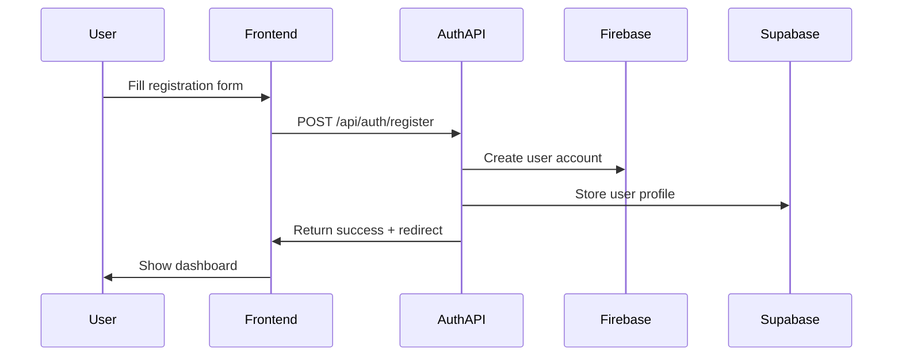
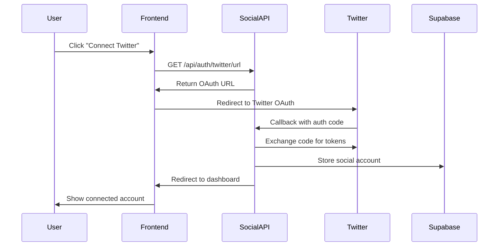
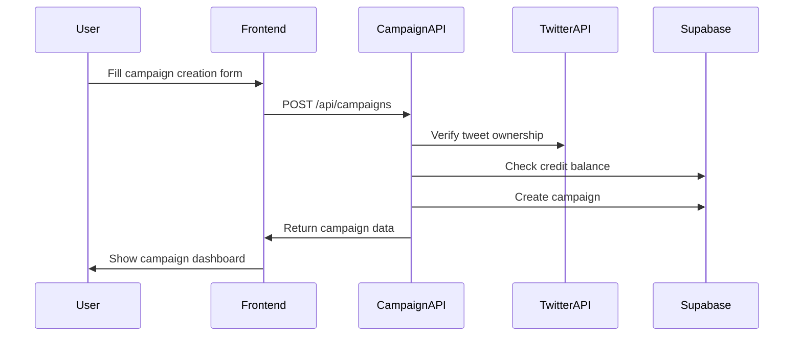
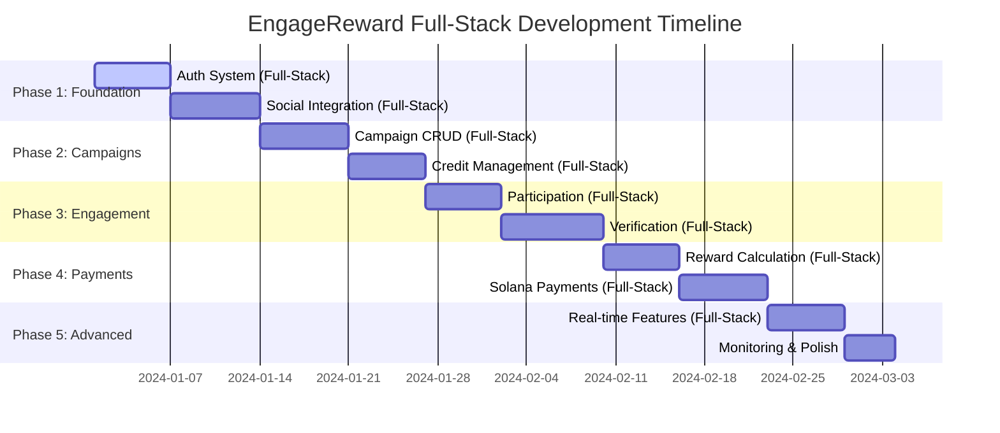

# Full-Stack Development Plan - EngageReward Platform

## 📋 Overview

This document provides a comprehensive step-by-step **full-stack development plan** organized by modules, where backend and frontend are developed together in each phase. This approach ensures working features faster and better integration.

**Current Status**: ✅ Frontend foundation complete | 🔄 Full-stack development needed

## 🎯 Development Strategy

### **Full-Stack Phase-Based Approach**
- **Phase 1**: Core Foundation (Auth System) - Week 1-2
- **Phase 2**: Campaign Management System - Week 3-4  
- **Phase 3**: Twitter Integration & Verification - Week 5-6
- **Phase 4**: Payment & Reward Distribution - Week 7-8
- **Phase 5**: Advanced Features & Optimization - Week 9-10

### **Full-Stack Module Architecture**
Each module includes both backend APIs and frontend components developed together, ensuring immediate testing and validation of complete user flows.

## 🚀 Full-Stack Development Benefits

### **Why Develop Backend + Frontend Together?**
1. **Immediate Validation**: Test complete user flows as you build
2. **Better Integration**: Frontend and backend designed together work seamlessly
3. **Faster Feedback**: Spot issues early when changes are easier to make
4. **Working Features**: Each phase delivers complete, demonstrable functionality
5. **User-Centric**: Focus on user experience from day one

### **Full-Stack Development Pattern**
Each module follows this pattern:
```
Day 1-3: Backend APIs + Database
├── API routes implementation
├── Database schema and operations
├── Business logic and validation
└── Error handling

Day 4-6: Frontend Integration
├── React components and forms
├── API integration and state management
├── UI/UX implementation
└── End-to-end testing

Day 7: Polish & Testing
├── Integration testing
├── Error handling on frontend
├── Performance optimization
└── User experience refinement
```

### **Development Tools for Full-Stack**
- **API Testing**: Built-in Next.js API routes + frontend forms
- **Real-time Testing**: See changes immediately in browser
- **Type Safety**: Shared TypeScript types between frontend/backend
- **Validation**: Zod schemas used in both API and forms
- **State Management**: Zustand + SWR for seamless data flow

---

## 🏗️ Phase 1: Core Foundation (Week 1-2)

### Module 1.1: Authentication System (Full-Stack) 🔐
**Priority**: Critical | **Effort**: 5-6 days | **Dependencies**: None

**User Stories Covered:**
- Story 1.1: Account Registration
- Story 1.2: Social Account Connection

**🔧 Backend APIs to Implement:**
```typescript
POST /api/auth/register          // User registration with Firebase
POST /api/auth/login             // User login verification
GET  /api/auth/profile           // Get user profile
PUT  /api/auth/profile           // Update user profile
POST /api/auth/verify-email      // Email verification
POST /api/auth/reset-password    // Password reset
```

**🎨 Frontend Components to Build:**
```typescript
// Authentication Components
src/components/auth/
├── LoginForm.tsx               // Login form with validation
├── RegisterForm.tsx            // Registration form
├── EmailVerification.tsx       // Email verification flow
├── PasswordReset.tsx           // Password reset flow
├── AuthProvider.tsx            // Auth context provider
└── ProtectedRoute.tsx          // Route protection HOC

// Pages to Update
src/app/login/page.tsx          // Replace placeholder with real form
src/app/register/page.tsx       // Replace placeholder with real form
src/app/dashboard/page.tsx      // New authenticated dashboard
src/app/profile/page.tsx        // User profile management
```

**🔄 Full-Stack Integration Flow:**


**🔄 Full-Stack Implementation Tasks:**

**Day 1-2: Backend Foundation**
1. **Firebase Admin SDK setup + auth middleware**
   ```typescript
   // src/lib/firebase-admin.ts
   import { initializeApp, getApps, cert } from 'firebase-admin/app';
   import { getAuth } from 'firebase-admin/auth';
   
   if (!getApps().length) {
     initializeApp({
       credential: cert({
         projectId: process.env.FIREBASE_PROJECT_ID,
         clientEmail: process.env.FIREBASE_CLIENT_EMAIL,
         privateKey: process.env.FIREBASE_PRIVATE_KEY?.replace(/\\n/g, '\n'),
       }),
     });
   }
   
   export const adminAuth = getAuth();
   ```

2. **User registration API with Supabase integration**
   ```typescript
   // src/app/api/auth/register/route.ts
   export async function POST(request: Request) {
     const body = await request.json();
     const { email, password } = userRegistrationSchema.parse(body);
     
     // Create Firebase user
     const firebaseUser = await adminAuth.createUser({ email, password });
     
     // Create user profile in Supabase
     const profile = await supabase.from('users').insert({
       firebase_uid: firebaseUser.uid,
       email: firebaseUser.email
     }).select().single();
     
     return NextResponse.json({ success: true, user: profile.data });
   }
   ```

**Day 3-4: Frontend Integration**
3. **Auth Context Provider & Hooks**
   ```typescript
   // src/lib/auth-context.tsx
   export const AuthProvider = ({ children }: { children: React.ReactNode }) => {
     const [user, setUser] = useState<User | null>(null);
     const [loading, setLoading] = useState(true);
     
     const signUp = async (email: string, password: string) => {
       const response = await fetch('/api/auth/register', {
         method: 'POST',
         headers: { 'Content-Type': 'application/json' },
         body: JSON.stringify({ email, password })
       });
       return response.json();
     };
     
     return (
       <AuthContext.Provider value={{ user, signUp, signIn, signOut }}>
         {children}
       </AuthContext.Provider>
     );
   };
   ```

4. **Registration Form Component**
   ```typescript
   // src/components/auth/RegisterForm.tsx
   export function RegisterForm() {
     const { register, handleSubmit, formState: { errors } } = useForm<RegisterFormData>({
       resolver: zodResolver(registerSchema)
     });
     const { signUp } = useAuth();
     
     const onSubmit = async (data: RegisterFormData) => {
       try {
         await signUp(data.email, data.password);
         router.push('/dashboard');
       } catch (error) {
         setError('Registration failed');
       }
     };
     
     return (
       <form onSubmit={handleSubmit(onSubmit)} className="space-y-4">
         <Input {...register('email')} type="email" placeholder="Email" />
         <Input {...register('password')} type="password" placeholder="Password" />
         <Button type="submit">Create Account</Button>
       </form>
     );
   }
   ```

**Day 5-6: Complete Integration & Testing**
5. **Update Register Page with Real Form**
6. **Create Protected Dashboard Page**
7. **End-to-end testing of auth flow**

**Database Schema:**
```sql
-- Users table (Supabase)
CREATE TABLE users (
  id UUID PRIMARY KEY DEFAULT gen_random_uuid(),
  firebase_uid TEXT UNIQUE NOT NULL,
  email TEXT UNIQUE NOT NULL,
  created_at TIMESTAMP WITH TIME ZONE DEFAULT NOW(),
  updated_at TIMESTAMP WITH TIME ZONE DEFAULT NOW(),
  is_active BOOLEAN DEFAULT true,
  role TEXT DEFAULT 'member' CHECK (role IN ('member', 'leader', 'admin'))
);

-- User profiles table
CREATE TABLE user_profiles (
  user_id UUID REFERENCES users(id) ON DELETE CASCADE PRIMARY KEY,
  display_name TEXT,
  bio TEXT,
  avatar_url TEXT,
  timezone TEXT DEFAULT 'UTC',
  preferences JSONB DEFAULT '{}',
  updated_at TIMESTAMP WITH TIME ZONE DEFAULT NOW()
);
```

**Acceptance Criteria:**
- [ ] User can register with Firebase Auth
- [ ] Email verification works
- [ ] User profile CRUD operations
- [ ] Error handling for auth failures
- [ ] JWT token validation middleware

---

### Module 1.2: Social Account Integration (Full-Stack) 🐦
**Priority**: Critical | **Effort**: 6-7 days | **Dependencies**: Module 1.1

**🔧 Backend APIs to Implement:**
```typescript
GET  /api/auth/twitter/url       // Generate OAuth URL
GET  /api/auth/twitter/callback  // OAuth callback handler
POST /api/social/connect         // Connect social account
DELETE /api/social/disconnect    // Disconnect social account
GET  /api/social/accounts        // List connected accounts
```

**🎨 Frontend Components to Build:**
```typescript
// Social Account Components
src/components/social/
├── TwitterConnectButton.tsx    // Twitter connection button
├── SocialAccountCard.tsx       // Display connected account
├── SocialAccountList.tsx       // List all connected accounts
├── ConnectAccountModal.tsx     // Connection flow modal
└── DisconnectConfirm.tsx       // Disconnect confirmation

// Pages to Create/Update
src/app/dashboard/social/page.tsx    // Social accounts management
src/app/profile/page.tsx             // Add social accounts section
src/components/layout/Header.tsx     // Show connected status
```

**🔄 Full-Stack Integration Flow:**


**Implementation Tasks:**
1. **Day 1**: Twitter OAuth 2.0 PKCE flow setup
   ```typescript
   // src/lib/services/twitter-auth.ts
   export class TwitterAuthService {
     static generateAuthUrl(userId: string) {
       const state = this.generateState(userId);
       const codeChallenge = this.generateCodeChallenge();
       
       return `https://twitter.com/i/oauth2/authorize?` +
         `response_type=code&` +
         `client_id=${process.env.TWITTER_CLIENT_ID}&` +
         `redirect_uri=${encodeURIComponent(redirectUri)}&` +
         `scope=tweet.read%20users.read&` +
         `state=${state}&` +
         `code_challenge=${codeChallenge}&` +
         `code_challenge_method=S256`;
     }
   }
   ```

2. **Day 2**: OAuth callback processing and token storage
3. **Day 3**: Social account management APIs
4. **Day 4**: Account verification and duplicate prevention
5. **Day 5**: Testing and error handling

**Database Schema:**
```sql
CREATE TABLE social_accounts (
  id UUID PRIMARY KEY DEFAULT gen_random_uuid(),
  user_id UUID REFERENCES users(id) ON DELETE CASCADE,
  platform TEXT NOT NULL CHECK (platform = 'twitter'),
  platform_user_id TEXT NOT NULL,
  username TEXT NOT NULL,
  display_name TEXT,
  profile_image_url TEXT,
  access_token TEXT, -- Encrypted
  refresh_token TEXT, -- Encrypted
  created_at TIMESTAMP WITH TIME ZONE DEFAULT NOW(),
  updated_at TIMESTAMP WITH TIME ZONE DEFAULT NOW(),
  UNIQUE(platform, platform_user_id)
);
```

---

## 📋 Phase 2: Campaign Management System (Week 3-4)

### Module 2.1: Campaign CRUD Operations (Full-Stack) 📋
**Priority**: High | **Effort**: 6-7 days | **Dependencies**: Module 1.1, 1.2

**User Stories Covered:**
- Story 2.1: Campaign Creation
- Story 2.2: Credit Management  
- Story 2.3: Campaign Monitoring

**🔧 Backend APIs to Implement:**
```typescript
GET  /api/campaigns              // List campaigns (public + user's)
POST /api/campaigns              // Create campaign
GET  /api/campaigns/[id]         // Get campaign details
PUT  /api/campaigns/[id]         // Update campaign
DELETE /api/campaigns/[id]       // Delete campaign
POST /api/campaigns/[id]/activate // Activate campaign
```

**🎨 Frontend Components to Build:**
```typescript
// Campaign Components
src/components/campaign/
├── CampaignCreateForm.tsx      // Multi-step campaign creation
├── CampaignCard.tsx            // Campaign display card
├── CampaignList.tsx            // Campaign listing with filters
├── CampaignDetails.tsx         // Detailed campaign view
├── CampaignMetrics.tsx         // Performance metrics
├── TweetPreview.tsx            // Tweet preview component
└── BudgetCalculator.tsx        // Reward budget calculator

// Pages to Create
src/app/dashboard/campaigns/
├── page.tsx                    // Campaign dashboard
├── create/page.tsx             // Campaign creation wizard
├── [id]/page.tsx              // Campaign details/management
└── [id]/edit/page.tsx         // Campaign editing

// Update existing pages
src/app/campaigns/page.tsx      // Public campaign browser
```

**🔄 Full-Stack Integration Flow:**


**Implementation Tasks:**
1. **Day 1**: Campaign data model and database schema
2. **Day 2**: Campaign CRUD API routes
   ```typescript
   // src/app/api/campaigns/route.ts
   export async function POST(request: Request) {
     const user = await validateFirebaseToken(request);
     const body = await request.json();
     
     const validatedData = createCampaignSchema.parse(body);
     
     // Verify tweet ownership
     await TwitterVerificationService.verifyTweetOwnership(user.uid, validatedData.tweetUrl);
     
     // Check credit balance
     await CreditService.validateBalance(user.uid, validatedData.budget);
     
     // Create campaign
     const campaign = await CampaignService.createCampaign(user.uid, validatedData);
     
     return NextResponse.json({ success: true, data: campaign });
   }
   ```

3. **Day 3**: Tweet ownership verification logic
4. **Day 4**: Campaign activation and budget validation
5. **Day 5**: Campaign listing and filtering

**Database Schema:**
```sql
CREATE TABLE campaigns (
  id UUID PRIMARY KEY DEFAULT gen_random_uuid(),
  creator_id UUID REFERENCES users(id) ON DELETE CASCADE,
  name TEXT NOT NULL,
  description TEXT,
  tweet_url TEXT NOT NULL,
  tweet_id TEXT NOT NULL,
  status TEXT DEFAULT 'draft' CHECK (status IN ('draft', 'active', 'completed', 'cancelled')),
  budget_usdc DECIMAL(10,6) NOT NULL,
  rewards JSONB NOT NULL, -- {like: 0.01, comment: 0.05, retweet: 0.02}
  token_config JSONB, -- Optional token airdrop settings
  duration_hours INTEGER DEFAULT 24,
  starts_at TIMESTAMP WITH TIME ZONE,
  ends_at TIMESTAMP WITH TIME ZONE,
  created_at TIMESTAMP WITH TIME ZONE DEFAULT NOW(),
  updated_at TIMESTAMP WITH TIME ZONE DEFAULT NOW()
);

CREATE INDEX idx_campaigns_creator ON campaigns(creator_id);
CREATE INDEX idx_campaigns_status ON campaigns(status);
CREATE INDEX idx_campaigns_created_at ON campaigns(created_at DESC);
```

---

### Module 2.2: Credit Management System 💳
**Priority**: High | **Effort**: 3-4 days | **Dependencies**: Module 2.1

**API Routes to Implement:**
```typescript
GET  /api/users/credits          // Get credit balance
POST /api/payments/deposit       // Generate deposit instructions
GET  /api/payments/transactions  // Transaction history
POST /api/webhooks/solana        // Solana deposit webhook
```

**Implementation Tasks:**
1. **Day 1**: Credit system database design
2. **Day 2**: Solana deposit monitoring service
   ```typescript
   // src/lib/services/solana-monitor.ts
   export class SolanaMonitorService {
     static async monitorDeposits() {
       const signatures = await connection.getSignaturesForAddress(
         new PublicKey(process.env.PLATFORM_WALLET_ADDRESS!)
       );
       
       for (const sig of signatures) {
         if (!await this.isProcessed(sig.signature)) {
           const tx = await connection.getTransaction(sig.signature);
           if (this.isUSDCDeposit(tx)) {
             await this.processDeposit(tx);
           }
         }
       }
     }
   }
   ```

3. **Day 3**: Credit balance APIs and transaction tracking
4. **Day 4**: Deposit instruction generation and webhook handling

**Database Schema:**
```sql
CREATE TABLE user_credits (
  user_id UUID REFERENCES users(id) ON DELETE CASCADE PRIMARY KEY,
  balance_usdc DECIMAL(12,6) DEFAULT 0,
  reserved_usdc DECIMAL(12,6) DEFAULT 0,
  total_deposited DECIMAL(12,6) DEFAULT 0,
  total_spent DECIMAL(12,6) DEFAULT 0,
  updated_at TIMESTAMP WITH TIME ZONE DEFAULT NOW()
);

CREATE TABLE credit_transactions (
  id UUID PRIMARY KEY DEFAULT gen_random_uuid(),
  user_id UUID REFERENCES users(id) ON DELETE CASCADE,
  type TEXT NOT NULL CHECK (type IN ('deposit', 'reserve', 'release', 'spend')),
  amount_usdc DECIMAL(12,6) NOT NULL,
  reference_id UUID, -- Campaign ID or transaction hash
  description TEXT,
  blockchain_hash TEXT,
  status TEXT DEFAULT 'pending' CHECK (status IN ('pending', 'confirmed', 'failed')),
  created_at TIMESTAMP WITH TIME ZONE DEFAULT NOW()
);

CREATE INDEX idx_credit_transactions_user ON credit_transactions(user_id);
CREATE INDEX idx_credit_transactions_type ON credit_transactions(type);
```

---

## 🐦 Phase 3: Twitter Integration & Verification (Week 5-6)

### Module 3.1: Campaign Participation 👥
**Priority**: High | **Effort**: 3-4 days | **Dependencies**: Module 2.1

**User Stories Covered:**
- Story 3.1: Campaign Discovery
- Story 3.2: Campaign Registration

**API Routes to Implement:**
```typescript
POST /api/campaigns/[id]/register    // Register for campaign
GET  /api/campaigns/[id]/participants // Get participants
DELETE /api/campaigns/[id]/unregister // Unregister from campaign
GET  /api/users/campaigns            // User's campaign participation
```

**Implementation Tasks:**
1. **Day 1**: Participant registration system
2. **Day 2**: Wallet address validation and storage
3. **Day 3**: Registration management APIs
4. **Day 4**: Participant listing and validation

**Database Schema:**
```sql
CREATE TABLE campaign_participants (
  id UUID PRIMARY KEY DEFAULT gen_random_uuid(),
  campaign_id UUID REFERENCES campaigns(id) ON DELETE CASCADE,
  user_id UUID REFERENCES users(id) ON DELETE CASCADE,
  wallet_address TEXT NOT NULL,
  registered_at TIMESTAMP WITH TIME ZONE DEFAULT NOW(),
  UNIQUE(campaign_id, user_id)
);

CREATE INDEX idx_participants_campaign ON campaign_participants(campaign_id);
CREATE INDEX idx_participants_user ON campaign_participants(user_id);
```

---

### Module 3.2: Engagement Verification System ✅
**Priority**: Critical | **Effort**: 5-6 days | **Dependencies**: Module 3.1

**User Stories Covered:**
- Story 3.3: Engagement Tracking
- Story 3.4: Reward Receipt

**API Routes to Implement:**
```typescript
POST /api/campaigns/[id]/verify      // Trigger verification (manual/scheduled)
GET  /api/campaigns/[id]/engagements // Get verified engagements
GET  /api/campaigns/[id]/metrics     // Campaign performance metrics
POST /api/admin/verify-all           // Admin bulk verification
```

**Implementation Tasks:**
1. **Day 1**: Twitter API integration for engagement fetching
   ```typescript
   // src/lib/services/twitter-client.ts
   export class TwitterClient {
     static async getTweetEngagements(tweetId: string) {
       const [likes, retweets, replies] = await Promise.all([
         this.getTweetLikes(tweetId),
         this.getTweetRetweets(tweetId),
         this.getTweetReplies(tweetId)
       ]);
       
       return { likes, retweets, replies };
     }
   }
   ```

2. **Day 2**: Engagement verification logic
3. **Day 3**: Cross-referencing participants with Twitter data
4. **Day 4**: Automated scheduling system (24-hour trigger)
5. **Day 5**: Verification API routes and error handling
6. **Day 6**: Testing and edge case handling

**Database Schema:**
```sql
CREATE TABLE verified_engagements (
  id UUID PRIMARY KEY DEFAULT gen_random_uuid(),
  campaign_id UUID REFERENCES campaigns(id) ON DELETE CASCADE,
  user_id UUID REFERENCES users(id) ON DELETE CASCADE,
  engagement_type TEXT NOT NULL CHECK (engagement_type IN ('like', 'comment', 'retweet')),
  twitter_interaction_id TEXT NOT NULL,
  verified_at TIMESTAMP WITH TIME ZONE DEFAULT NOW(),
  UNIQUE(campaign_id, user_id, engagement_type)
);

CREATE INDEX idx_verified_engagements_campaign ON verified_engagements(campaign_id);
CREATE INDEX idx_verified_engagements_user ON verified_engagements(user_id);
```

---

## 💰 Phase 4: Payment & Reward Distribution (Week 7-8)

### Module 4.1: Reward Calculation Engine 🧮
**Priority**: Critical | **Effort**: 3-4 days | **Dependencies**: Module 3.2

**API Routes to Implement:**
```typescript
POST /api/campaigns/[id]/calculate   // Calculate rewards
GET  /api/campaigns/[id]/rewards     // Get calculated rewards
POST /api/campaigns/[id]/distribute  // Distribute rewards
GET  /api/users/earnings            // User earnings history
```

**Implementation Tasks:**
1. **Day 1**: Reward calculation algorithms
   ```typescript
   // src/lib/services/reward-service.ts
   export class RewardService {
     static async calculateRewards(campaignId: string) {
       const campaign = await CampaignService.getCampaign(campaignId);
       const engagements = await VerificationService.getVerifiedEngagements(campaignId);
       
       const rewards = engagements.map(engagement => ({
         userId: engagement.user_id,
         walletAddress: engagement.wallet_address,
         amount: campaign.rewards[engagement.engagement_type],
         engagementType: engagement.engagement_type,
         campaignId
       }));
       
       return this.aggregateRewardsByUser(rewards);
     }
   }
   ```

2. **Day 2**: Reward aggregation and validation
3. **Day 3**: Reward calculation APIs
4. **Day 4**: Testing calculation accuracy

---

### Module 4.2: Solana Payment Processing 💰
**Priority**: Critical | **Effort**: 4-5 days | **Dependencies**: Module 4.1

**Implementation Tasks:**
1. **Day 1**: Solana wallet management and USDC token handling
2. **Day 2**: Batch transfer transaction creation
   ```typescript
   // src/lib/services/payment-service.ts
   export class PaymentService {
     static async distributeRewards(campaignId: string) {
       const rewards = await RewardService.calculateRewards(campaignId);
       
       // Create batch transfer instructions
       const instructions = rewards.map(reward => 
         createTransferInstruction(
           platformTokenAccount,
           new PublicKey(reward.walletAddress),
           platformWallet.publicKey,
           Math.floor(reward.amount * 1_000_000) // Convert to lamports
         )
       );
       
       // Execute batch transaction
       const transaction = new Transaction().add(...instructions);
       const signature = await sendAndConfirmTransaction(
         connection, 
         transaction, 
         [platformWallet]
       );
       
       return signature;
     }
   }
   ```

3. **Day 3**: Payment execution and confirmation tracking
4. **Day 4**: Failed payment retry mechanisms
5. **Day 5**: Payment status APIs and webhooks

**Database Schema:**
```sql
CREATE TABLE reward_distributions (
  id UUID PRIMARY KEY DEFAULT gen_random_uuid(),
  campaign_id UUID REFERENCES campaigns(id) ON DELETE CASCADE,
  user_id UUID REFERENCES users(id) ON DELETE CASCADE,
  amount_usdc DECIMAL(10,6) NOT NULL,
  wallet_address TEXT NOT NULL,
  engagement_type TEXT NOT NULL,
  blockchain_hash TEXT,
  status TEXT DEFAULT 'pending' CHECK (status IN ('pending', 'confirmed', 'failed')),
  distributed_at TIMESTAMP WITH TIME ZONE DEFAULT NOW()
);

CREATE INDEX idx_reward_distributions_campaign ON reward_distributions(campaign_id);
CREATE INDEX idx_reward_distributions_user ON reward_distributions(user_id);
CREATE INDEX idx_reward_distributions_status ON reward_distributions(status);
```

---

## 🚀 Phase 5: Advanced Features & Optimization (Week 9-10)

### Module 5.1: Real-time Features ⚡
**Priority**: Medium | **Effort**: 3-4 days | **Dependencies**: All previous modules

**Implementation Tasks:**
1. **Day 1**: Supabase real-time subscriptions
   ```typescript
   // src/lib/services/realtime-service.ts
   export class RealtimeService {
     static subscribeToUserUpdates(userId: string, callback: (data: any) => void) {
       return supabase
         .channel(`user_${userId}`)
         .on('postgres_changes', {
           event: '*',
           schema: 'public',
           table: 'user_credits',
           filter: `user_id=eq.${userId}`
         }, callback)
         .subscribe();
     }
   }
   ```

2. **Day 2**: Campaign status broadcasting
3. **Day 3**: Credit balance live updates
4. **Day 4**: Real-time notification system

---

### Module 5.2: Monitoring & Analytics 📊
**Priority**: Medium | **Effort**: 2-3 days | **Dependencies**: All modules

**Implementation Tasks:**
1. **Day 1**: Health check endpoints
   ```typescript
   // src/app/api/health/route.ts
   export async function GET() {
     const health = {
       status: 'healthy',
       timestamp: new Date().toISOString(),
       services: {
         database: await this.checkSupabase(),
         twitter: await this.checkTwitterAPI(),
         solana: await this.checkSolanaRPC(),
         firebase: await this.checkFirebase()
       }
     };
     
     const allHealthy = Object.values(health.services).every(s => s.status === 'healthy');
     
     return NextResponse.json(health, {
       status: allHealthy ? 200 : 503
     });
   }
   ```

2. **Day 2**: Performance monitoring and logging
3. **Day 3**: Analytics data collection

---

## 📅 Full-Stack Development Timeline



### **Weekly Breakdown:**
- **Week 1**: Authentication System (Backend + Frontend)
- **Week 2**: Social Integration (Twitter OAuth + UI)
- **Week 3**: Campaign Management (CRUD + Forms)
- **Week 4**: Credit System (Payments + Dashboard)
- **Week 5**: Participation System (Registration + UI)
- **Week 6**: Engagement Verification (Auto-tracking + Metrics)
- **Week 7**: Reward Calculation (Engine + Display)
- **Week 8**: Payment Distribution (Solana + Status UI)
- **Week 9**: Real-time Features (Live Updates + Notifications)
- **Week 10**: Polish & Deployment (Testing + Launch)

## 🎯 Development Order & Dependencies

### **Critical Path (Must Complete in Order):**
1. **Module 1.1**: Authentication System → Foundation for all other modules
2. **Module 1.2**: Social Account Integration → Required for Twitter verification
3. **Module 2.1**: Campaign CRUD → Core business functionality
4. **Module 3.2**: Engagement Verification → Core value proposition
5. **Module 4.2**: Payment Processing → Revenue generation

### **Parallel Development Opportunities:**
- **Module 2.2** (Credit Management) can be developed alongside **Module 2.1**
- **Module 3.1** (Participation) can be developed alongside **Module 3.2**
- **Module 5.1** (Real-time) can be added incrementally
- **Error handling and logging** should be built into each module

## ✅ Module Completion Checklist

### **For Each Module:**
- [ ] **Database Schema**: Tables created and indexed
- [ ] **API Routes**: All endpoints implemented and tested
- [ ] **Service Layer**: Business logic and external integrations
- [ ] **Validation**: Input validation with Zod schemas
- [ ] **Error Handling**: Consistent error responses
- [ ] **Testing**: Unit and integration tests
- [ ] **Documentation**: API endpoint documentation

### **Cross-Cutting Concerns:**
- [ ] **Authentication**: JWT validation on protected routes
- [ ] **Rate Limiting**: Prevent API abuse
- [ ] **Logging**: Request/response logging with structured data
- [ ] **Monitoring**: Performance and error tracking
- [ ] **Security**: Input sanitization, CORS, and HTTPS

## 🔧 Environment Setup Requirements

### **External Services to Set Up:**
1. **Firebase Project**: Authentication service
2. **Supabase Project**: PostgreSQL database and real-time features
3. **Twitter Developer Account**: API access for OAuth and engagement data
4. **Solana Wallet**: Platform wallet for USDC transactions
5. **Helius Account**: Enhanced Solana RPC access (optional)

### **Environment Variables Needed:**
```bash
# Firebase
FIREBASE_PROJECT_ID=your_firebase_project_id
FIREBASE_PRIVATE_KEY=your_firebase_private_key
FIREBASE_CLIENT_EMAIL=your_firebase_client_email

# Supabase
NEXT_PUBLIC_SUPABASE_URL=your_supabase_url
NEXT_PUBLIC_SUPABASE_ANON_KEY=your_supabase_anon_key
SUPABASE_SERVICE_ROLE_KEY=your_service_role_key

# Twitter API
TWITTER_CLIENT_ID=your_twitter_client_id
TWITTER_CLIENT_SECRET=your_twitter_client_secret
TWITTER_BEARER_TOKEN=your_twitter_bearer_token

# Solana
NEXT_PUBLIC_SOLANA_RPC_URL=https://api.mainnet-beta.solana.com
PLATFORM_WALLET_PRIVATE_KEY=your_wallet_private_key_base58
PLATFORM_WALLET_ADDRESS=your_wallet_public_key

# Application
NEXTAUTH_SECRET=your_nextauth_secret_key
NEXT_PUBLIC_APP_URL=https://your-domain.com
```

## 🚀 Next Immediate Steps (Full-Stack Approach)

### **This Week (Module 1.1 - Authentication System):**

**Days 1-2: Backend Foundation**
1. **Set up external services** (Firebase project + Supabase project)
2. **Implement Firebase Admin SDK** integration
3. **Create user registration API** endpoint
4. **Set up database schema** for users

**Days 3-4: Frontend Integration**  
5. **Create Auth Context Provider** and hooks
6. **Build Registration Form** component with validation
7. **Update register page** with real form
8. **Implement login flow** and protected routes

**Days 5-6: Complete Integration**
9. **Create dashboard page** for authenticated users
10. **Add profile management** functionality
11. **Test complete auth flow** end-to-end
12. **Polish UI/UX** and error handling

### **Full-Stack Development Approach:**
```typescript
// Week 1 Deliverables (Working Features):
✅ User Registration: Backend API + Frontend Form
✅ User Login: Firebase Auth + React Context
✅ Protected Dashboard: Route protection + User profile
✅ Profile Management: CRUD operations + UI forms
✅ Error Handling: API errors + User feedback
```

### **Ready to Start Full-Stack Development?**

**🎯 Recommended Approach**: 
Start with **Module 1.1 (Full-Stack Authentication)** because:
- You'll have a complete working feature in 6 days
- Establishes patterns for all future modules  
- Provides immediate user value and testing capability
- Creates the foundation all other modules depend on

**🛠️ Setup Requirements:**
1. **Firebase Project**: For authentication service
2. **Supabase Project**: For user data and real-time features
3. **Environment Variables**: Updated in `.env.local`

**📋 Success Criteria for Week 1:**
- [ ] Users can register and login successfully
- [ ] Protected dashboard shows user information
- [ ] Profile management works end-to-end
- [ ] Error handling provides clear user feedback
- [ ] All code is tested and ready for next module

---

## 📚 Additional Resources

- **Technical Documentation**: See `/docs/technical/` for detailed specs
- **Business Requirements**: See `/docs/business/` for user stories
- **API Documentation**: Will be generated as modules are completed
- **Testing Strategy**: See `/docs/technical/testing/test-strategy.md`

---

*This plan provides a clear 10-week roadmap to build the complete backend system that matches your technical documentation and user flow requirements. Each module builds upon the previous ones, ensuring a solid foundation for the EngageReward platform.*
