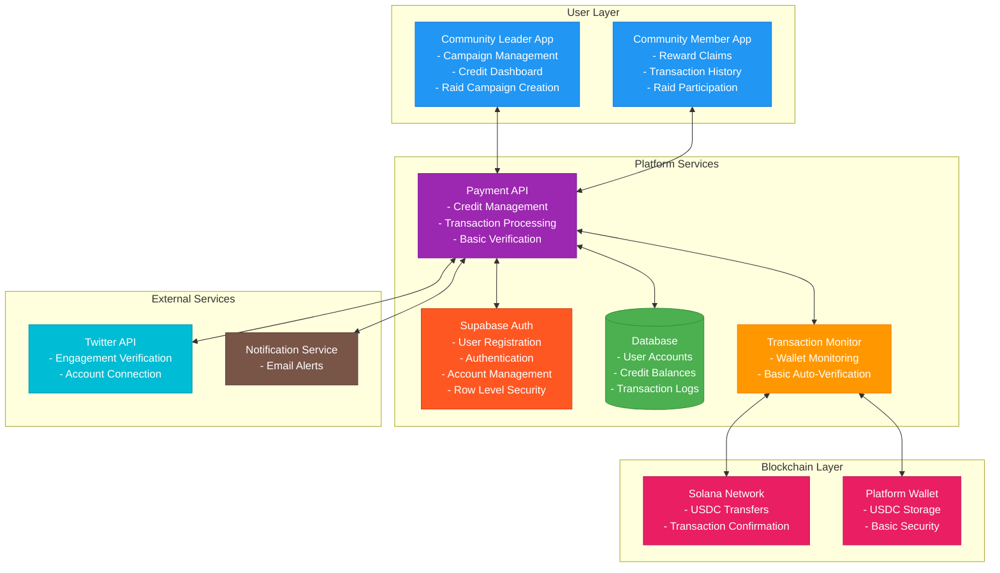
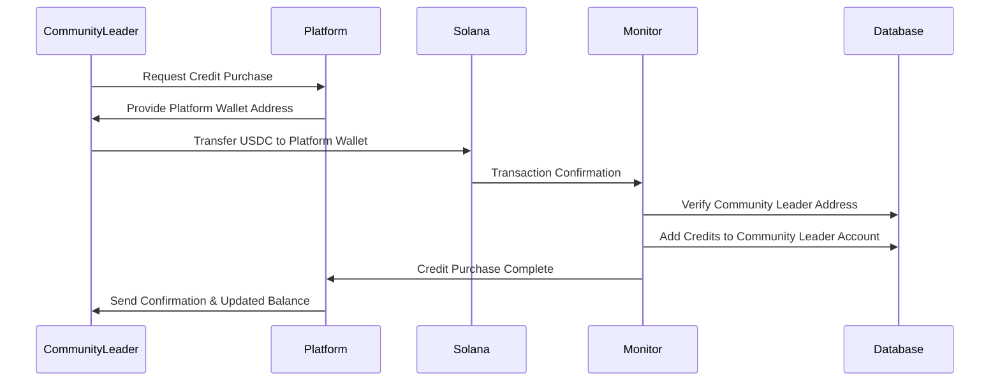
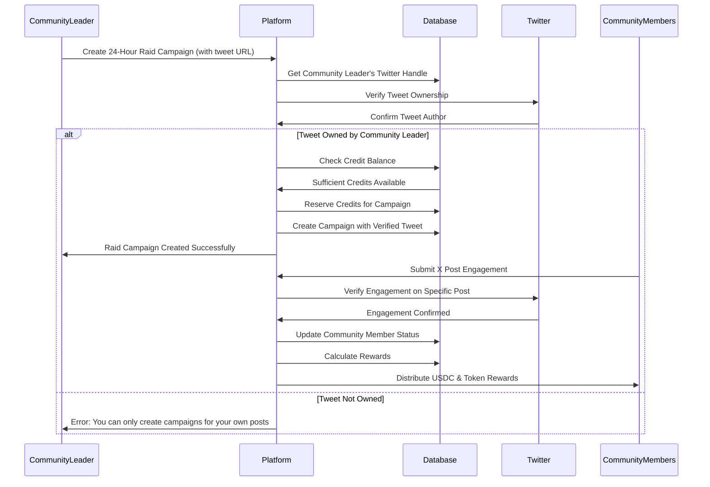
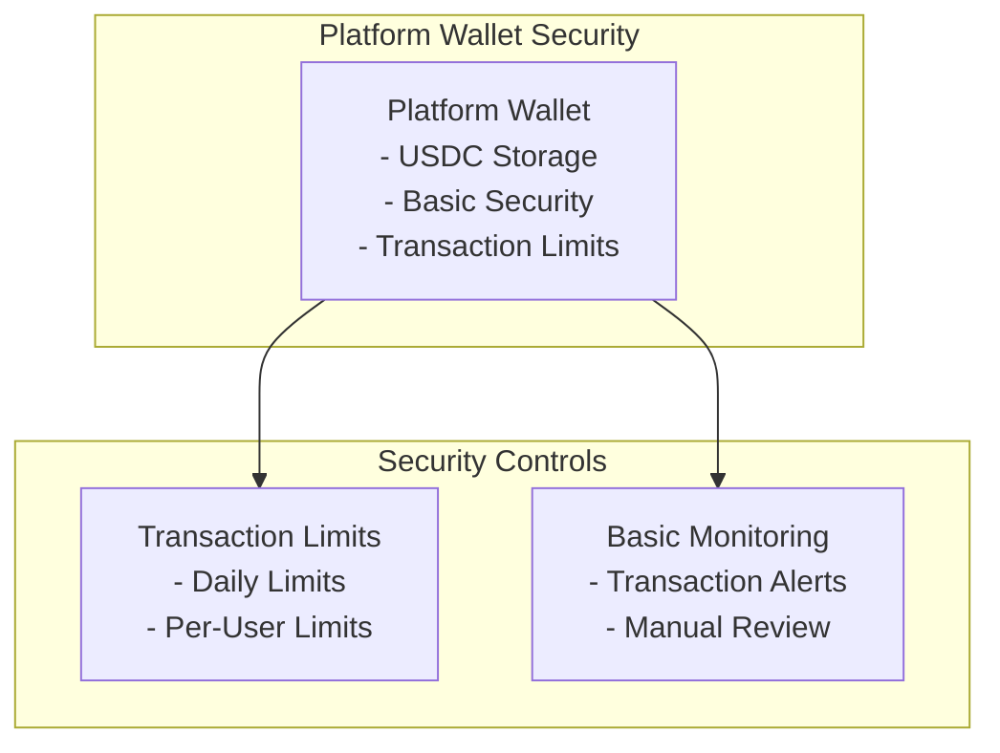
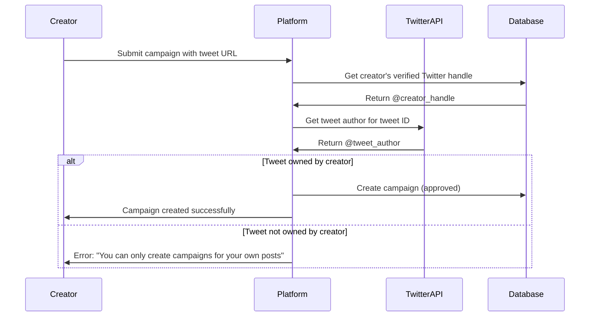

# Payment System Architecture Overview - MVP

## Table of Contents
- [Overview](#overview)
- [System Architecture](#system-architecture)
- [Component Diagram](#component-diagram)
- [Key Components](#key-components)
- [Data Flow](#data-flow)
- [Security Model](#security-model)
- [Technology Stack](#technology-stack)

## Overview

The EngageReward payment system is built on a **simple credit-based architecture** for the MVP. **Community leaders** deposit USDC directly to the platform wallet and receive platform credits for campaign funding. The system supports both USDC and token airdrops for community engagement rewards.

### Core Principles
- **Simplicity**: Easy-to-understand credit system
- **Security**: Basic security with platform wallet
- **User Experience**: Intuitive interface with basic error handling

## System Architecture

### High-Level Architecture

## Key Components

### 1. User Layer
| Component | Purpose | Key Features |
|-----------|---------|--------------|
| **Community Leader App** | Community leader interface for campaign management | Credit dashboard, raid campaign creation, basic engagement tracking |
| **Community Member App** | Community member interface for rewards | Reward claims, transaction history, raid participation |

### 2. Platform Services
| Component | Purpose | Key Features |
|-----------|---------|--------------|
| **Payment API** | Core payment processing logic | Credit management, transaction processing, basic verification |
| **Database** | Data persistence and management | User accounts, credit balances, transaction logs |
| **Transaction Monitor** | Basic transaction tracking | Wallet monitoring, auto-verification |

### 3. Blockchain Layer
| Component | Purpose | Key Features |
|-----------|---------|--------------|
| **Solana Network** | Blockchain infrastructure | USDC transfers, transaction confirmation |
| **Platform Wallet** | Secure fund storage | USDC storage, basic security |

### 4. External Services
| Component | Purpose | Key Features |
|-----------|---------|--------------|
| **Twitter API** | Social media integration | Engagement verification, account connection |
| **Notification Service** | User communication | Email alerts |

## Data Flow

### Primary Payment Flow

### Raid Campaign Flow

## Security Model

### Basic Security Architecture

### Security Layers

| Layer | Purpose | Implementation |
|-------|---------|----------------|
| **Application Security** | API protection and user authentication | Supabase Auth, basic rate limiting |
| **Campaign Security** | Creator-only campaign validation | Tweet ownership verification, social account linking |
| **Transaction Security** | Secure payment processing | Transaction limits, basic monitoring |
| **Infrastructure Security** | System and network protection | Basic firewalls, secure hosting |

### Creator-Only Campaign Security

The platform enforces a strict **creator-only model** where users can only create campaigns for their own Twitter posts. This security model prevents unauthorized promotion and maintains authenticity.

#### Tweet Ownership Verification Flow

#### Security Validation Steps

1. **Twitter Account Connection**: Creator must have verified Twitter account linked
2. **URL Validation**: Tweet URL must be valid and accessible
3. **Ownership Verification**: Tweet author must match creator's verified handle
4. **Access Control**: Only authenticated creators can create campaigns
5. **Audit Trail**: All verification attempts are logged

#### Security Benefits

- **Prevents Spam**: Users cannot promote others' content without permission
- **Maintains Authenticity**: Only genuine creators can incentivize their content
- **Legal Protection**: Avoids copyright and consent issues
- **Quality Control**: Ensures creators have genuine investment in their content
- **Trust Building**: Community knows they're supporting actual content creators

## Technology Stack

### Backend Technologies
- **API Framework**: Node.js with Express.js
- **Database**: PostgreSQL (Supabase)
- **Blockchain Integration**: Solana Web3.js
- **Authentication**: Supabase Auth
- **Social Media**: OAuth2 with platform-specific APIs

### Frontend Technologies
- **Web Application**: React.js
- **State Management**: Basic state management
- **UI Framework**: Material-UI
- **Authentication**: Supabase Auth SDK

### Infrastructure
- **Cloud Platform**: Supabase (PostgreSQL + Auth)
- **Database Service**: Supabase PostgreSQL
- **Authentication Service**: Supabase Auth
- **Basic Monitoring**: Simple logging and monitoring

### External Integrations
- **Blockchain**: Solana Network (via Helius RPC)
- **Social Media**: Twitter API, YouTube API (future)
- **Notifications**: Email service
- **User Management**: Supabase Auth

## Scalability Considerations

### Current Capacity
- **Daily Transactions**: Up to 50 credit purchases
- **Concurrent Users**: Up to 25 simultaneous users
- **Campaign Processing**: Up to 10 active campaigns
- **Reward Distribution**: Up to 50 rewards per hour

### Basic Scaling Strategy
- **Simple Load Balancing**: Basic load balancing across servers
- **Database Optimization**: Basic connection pooling
- **Batch Processing**: Simple batch processing for rewards

## Implementation Phases

### Phase 1: MVP (2-3 weeks)
- Basic credit system implementation
- Manual transaction verification
- Essential security measures
- Basic address validation
- Token airdrop support
- Simple campaign management

### Phase 2: Basic Enhancements (2-3 weeks)
- Automated transaction monitoring
- Basic address learning system
- Improved error handling
- Enhanced user interface

## Detailed Technical Specifications

For detailed implementation specifications including:
- **Database Schema**: Complete table definitions and relationships
- **API Specifications**: RESTful endpoints and data formats
- **External Integrations**: Twitter API, Solana RPC (Helius), Email service setup
- **Module Breakdown**: Detailed component architecture and functions
- **Security Implementation**: Specific security measures and configurations

See: **[Technical Implementation Guide](technical-implementation-guide.md)**

---

*This architecture overview provides a high-level understanding of the MVP payment system design. For detailed implementation specifications, refer to the Technical Implementation Guide.*
