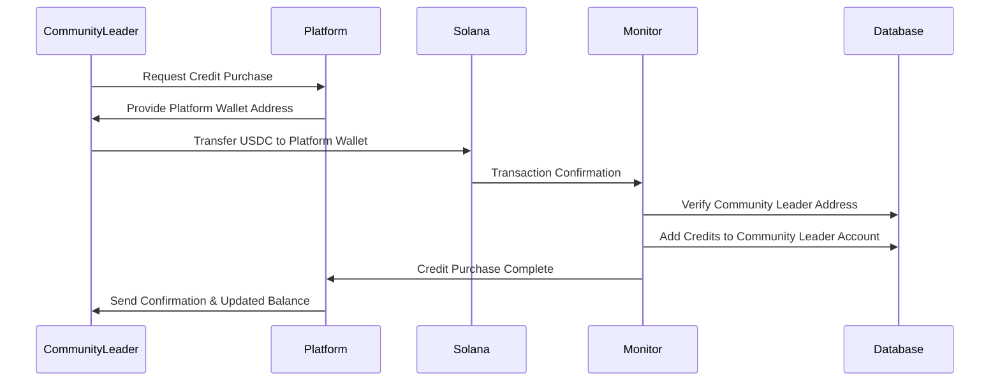
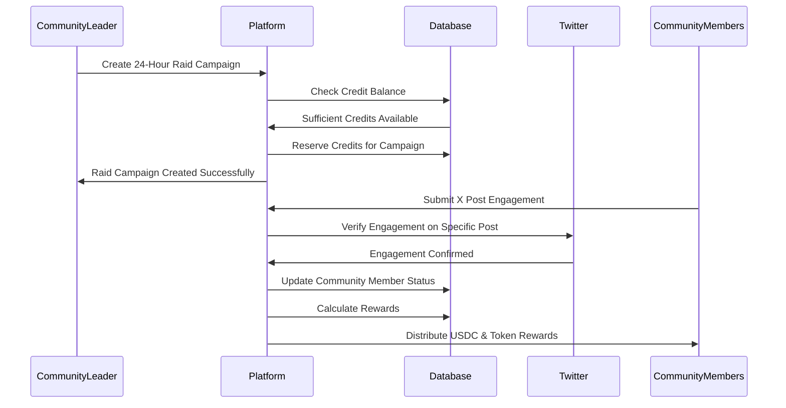
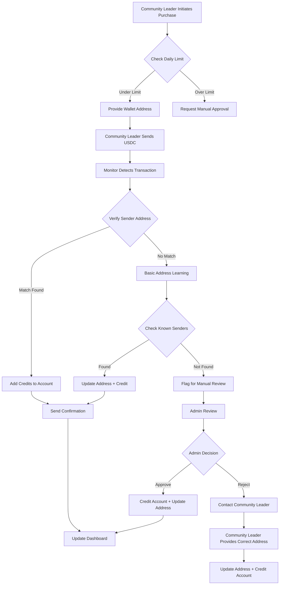
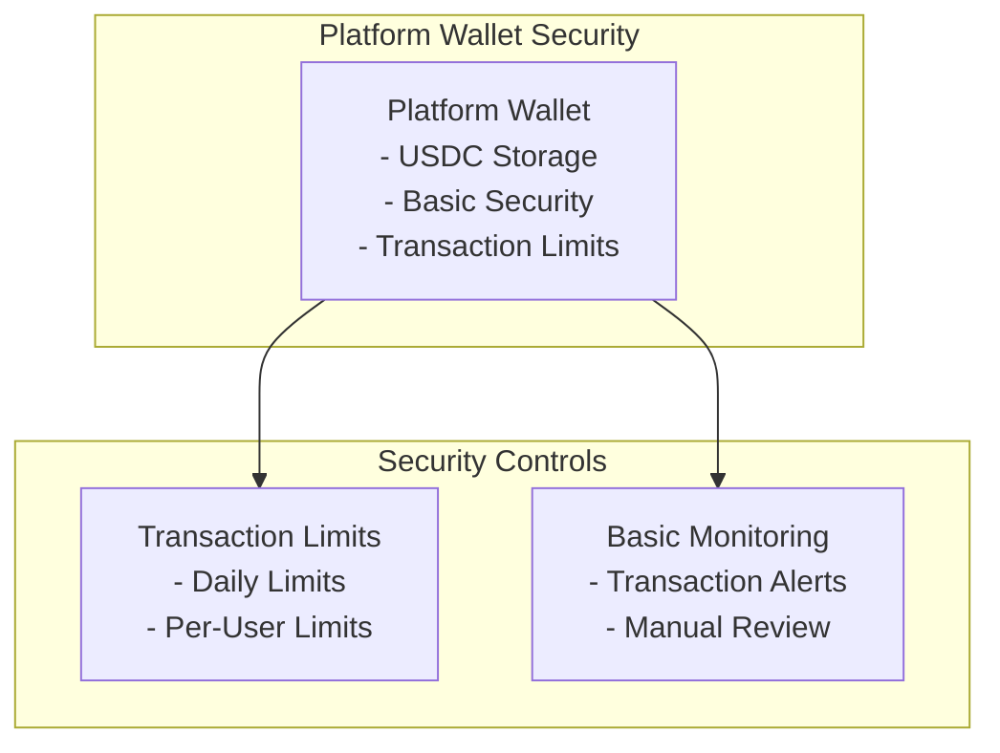

# Payment Architecture - Credit-Based System (MVP)

## Overview
This document outlines the payment architecture for EngageReward's social incentive platform MVP, using a simple credit-based system where **community leaders** deposit USDC directly to the platform wallet and receive platform credits for campaign funding. The system supports both USDC and token airdrops for community engagement rewards.

## Payment Flow

### **Community Leader Credit Purchase Flow**

### **Raid Campaign Flow**

### **Credit Management Flow**

## System Architecture

### **1. Credit Management System**

**Core Components:**
- **Credit Balance Tracking**: Real-time credit balance for each community leader
- **Transaction History**: Basic audit trail of all credit transactions
- **Purchase Limits**: Daily limits for credit purchases
- **Basic Verification**: Simple verification for credit purchases

**Security Features:**
- **Platform Wallet**: Single wallet for all transactions
- **Transaction Monitoring**: Basic monitoring of platform wallet
- **Manual Review**: Manual verification for flagged transactions

### **2. Transaction Monitoring System**

**Monitoring Capabilities:**
- **Basic Tracking**: Monitor platform wallet for incoming transactions
- **Address Matching**: Match transaction senders to community leader accounts
- **Amount Validation**: Verify transaction amounts match expected values
- **Confirmation Tracking**: Track transaction confirmations on blockchain

**Automation Features:**
- **Auto-Crediting**: Automatically credit accounts for verified transactions
- **Basic Alerts**: Notify administrators of large transactions
- **Manual Review**: Escalation system for unmatched transactions

**Basic Address Learning:**
- **Sender Address Tracking**: Track actual sender addresses from transactions
- **Address Auto-Correction**: Automatically update incorrect registered addresses
- **Manual Review Queue**: Basic escalation system for unmatched transactions

### **3. Raid Campaign System**

**Campaign Setup Process:**
- **Time-Limited Campaigns**: 24-hour engagement windows for specific X posts
- **Credit Reservation**: Reserve credits when raid campaign is created
- **Balance Validation**: Ensure sufficient credits before campaign activation
- **Post URL Tracking**: Monitor specific X post for engagement metrics
- **Refund Mechanism**: Return unused credits to community leader account

**Raid Engagement Tracking:**
- **Basic Monitoring**: Track likes, comments, retweets on specific X post
- **Time Window Validation**: Only count engagement within 24-hour period
- **Engagement Verification**: Cross-reference with Twitter API for authenticity
- **Participant Tracking**: Monitor which community members participated

**Reward Distribution:**
- **Basic Processing**: Process rewards in simple transactions
- **Failure Handling**: Handle failed reward distributions
- **Audit Trail**: Basic record of all reward distributions
- **Token Airdrops**: Distribute project tokens alongside USDC rewards

### **4. Basic Address Validation**

**Address Validation Process:**
- **Format Validation**: Verify Solana address format before storage
- **Duplicate Checking**: Prevent multiple community leaders from using same address
- **Basic Confirmation**: Email confirmation before address activation

**Error Mitigation Strategies:**
- **Real-time Matching**: Match transactions by sender address to community leader accounts
- **Address Learning**: Automatically update addresses based on actual transactions
- **Manual Review**: Basic escalation process for unmatched transactions

**Prevention Measures:**
- **Address Confirmation**: Email confirmation before activating addresses
- **Clear Instructions**: User-friendly setup guides and error messages
- **Support Integration**: Direct support contact for address issues

## Security Architecture

### **1. Basic Wallet Security**

### **2. Access Control**

**User Access Levels:**
- **Community Leaders**: Can purchase credits and fund campaigns
- **Community Members**: Can claim rewards and view transaction history
- **Administrators**: Can manage credits and handle disputes

**Security Measures:**
- **API Authentication**: Basic API access with rate limiting
- **Transaction Limits**: Basic limits for transactions
- **Audit Logging**: Basic audit trail of system actions

## Basic Risk Management

### **1. Financial Risks**

**Risk Categories:**
- **Transaction Risk**: Failed or delayed transactions
- **Address Error Risk**: Incorrect wallet addresses causing fund loss

**Mitigation Strategies:**
- **Transaction Limits**: Prevent large losses from single transactions
- **Manual Review**: Manual verification for large transactions
- **Address Validation**: Basic address verification and error recovery

### **2. Technical Risks**

**Risk Categories:**
- **Network Risk**: Solana network congestion or failures
- **Infrastructure Risk**: Platform downtime or data loss

**Mitigation Strategies:**
- **Network Monitoring**: Basic monitoring of Solana network conditions
- **Data Backup**: Regular backups of system data

## Scalability Considerations

### **1. Transaction Volume**

**Current Capacity:**
- **Daily Transactions**: Up to 100 credit purchases
- **Concurrent Users**: Up to 50 simultaneous users
- **Campaign Processing**: Up to 20 active campaigns
- **Reward Distribution**: Up to 100 rewards per hour

**Basic Scaling Strategy:**
- **Simple Batch Processing**: Group multiple transactions together
- **Basic Load Balancing**: Distribute load across multiple servers

## Basic Monitoring and Metrics

### **1. System Monitoring**

**Key Metrics:**
- **Transaction Success Rate**: Percentage of successful transactions
- **Processing Time**: Average time to process transactions
- **System Uptime**: Platform availability and reliability

**Monitoring Tools:**
- **Basic Dashboards**: Simple monitoring of system performance
- **Alert Systems**: Basic alerts for critical issues

### **2. Business Metrics**

**Key Metrics:**
- **Credit Purchase Volume**: Total volume of credit purchases
- **Campaign Success Rate**: Percentage of successful campaigns
- **User Engagement**: User activity and retention rates

## Conclusion

This credit-based payment architecture provides a simple, secure, and scalable solution for EngageReward's social incentive platform MVP. The system balances simplicity with security, allowing for rapid deployment while maintaining basic protection for user funds.

Key advantages of this approach:
- **Rapid Deployment**: Can be implemented in weeks rather than months
- **Proven Security**: Uses established security practices and tools
- **User-Friendly**: Simple and intuitive for users
- **Cost-Effective**: Lower development and maintenance costs

The architecture is designed to evolve with the platform, starting with a simple MVP and gradually adding more sophisticated features as the platform grows and matures.
