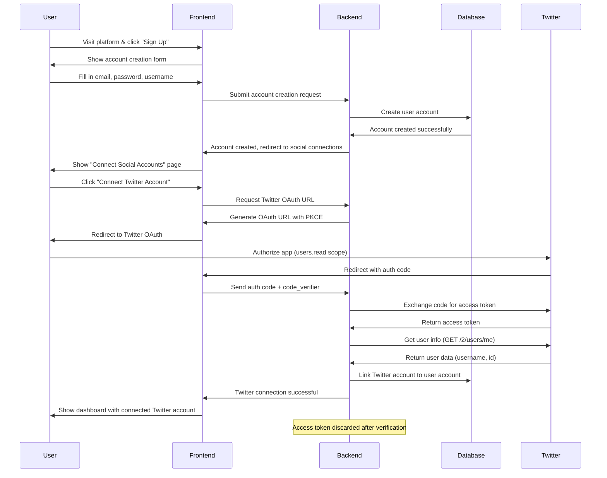
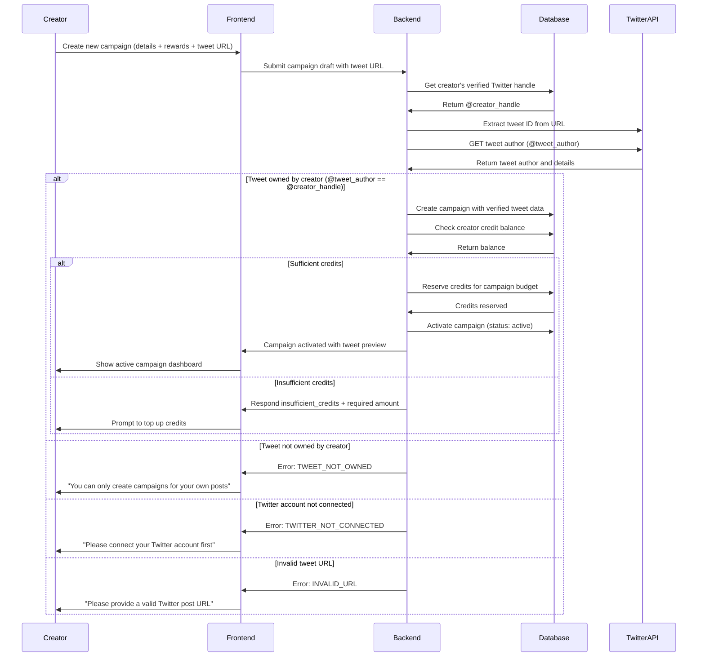
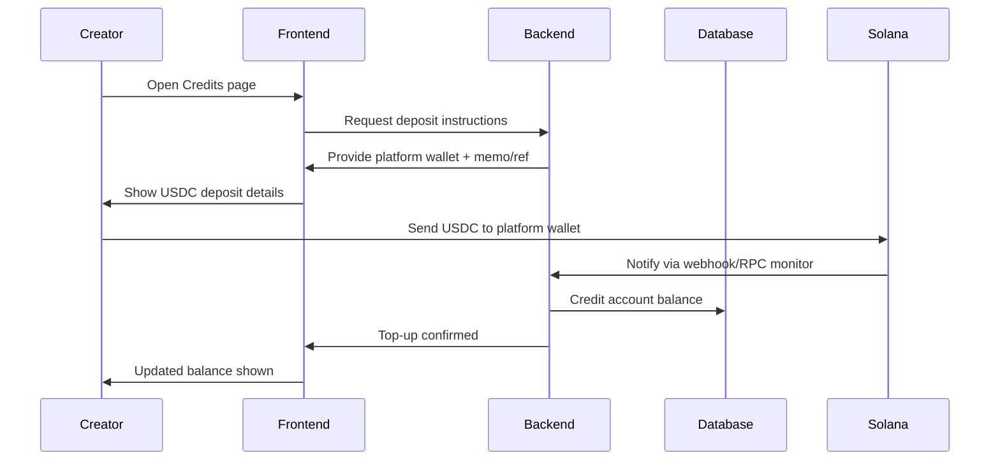
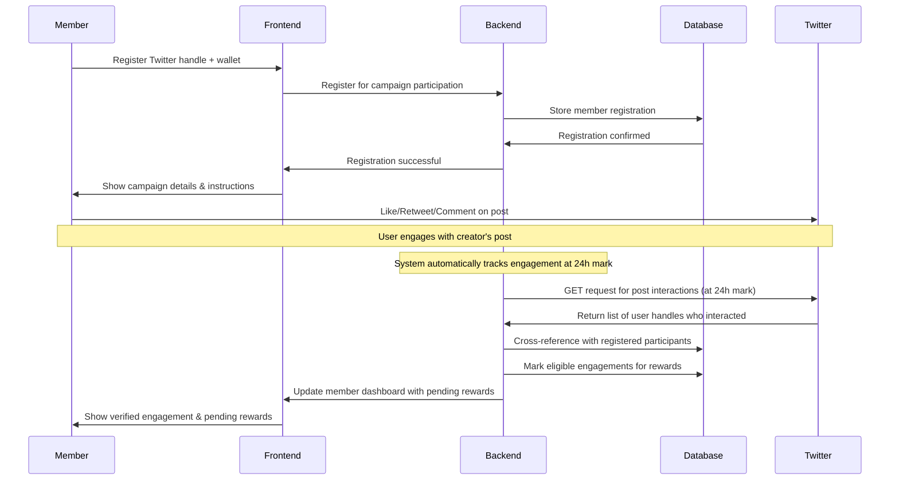
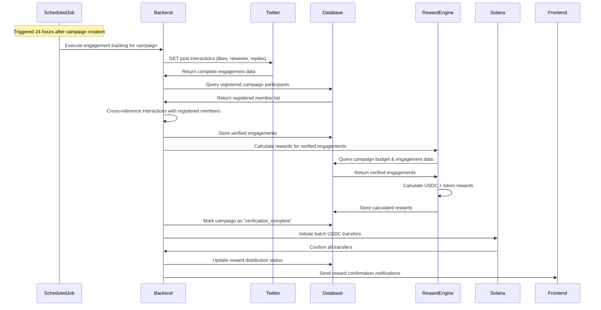
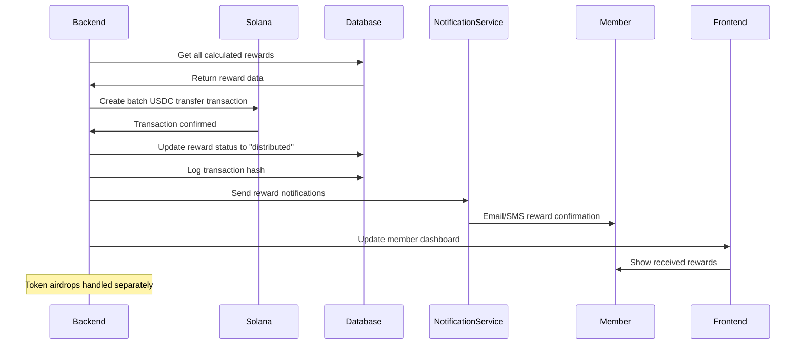

# User Flow Implementation - EngageReward Platform

## Overview

This document details the complete user journey from initial sign-up through receiving incentives, including all technical implementation steps, API calls, and system interactions.

## Architecture Benefits

### Multi-Platform Support
- **Separate user accounts** from social media connections
- **Easy to add new platforms** (YouTube, Instagram, TikTok, etc.)
- **Unified user experience** across all social platforms
- **Platform-agnostic reward system**

### Better User Management
- **Centralized user authentication** with Firebase Auth
- **Multiple social accounts** per user
- **Easier account recovery** and management
- **Better security** with platform-specific OAuth tokens
- **Built-in security features** (2FA, password reset, etc.)

### Scalability
- **Modular social platform integration**
- **Independent platform APIs** don't affect core user system
- **Easier testing** and development
- **Better separation of concerns**
- **Firebase handles authentication scaling** automatically

## Complete User Flow

### 1. User Account Creation & Twitter Connection



**Technical Implementation:**
```javascript
// 1. Create user account with Firebase Auth
const userCredential = await createUserWithEmailAndPassword(auth, userEmail, password);
const firebaseUser = userCredential.user;

// 2. Create user profile in our database
const userAccount = await createUserProfile({
  firebaseUid: firebaseUser.uid,
  email: userEmail,
  username: platformUsername,
  status: 'active',
  createdAt: new Date()
});

// 3. Generate Twitter OAuth URL with PKCE
const codeVerifier = generatePKCECodeVerifier();
const authUrl = `https://twitter.com/i/oauth2/authorize?response_type=code&client_id=${clientId}&redirect_uri=${redirectUri}&scope=users.read&state=${state}&code_challenge=${generateCodeChallenge(codeVerifier)}&code_challenge_method=S256`;

// 4. Exchange code for token
const tokenResponse = await exchangeCodeForToken(authCode, codeVerifier);

// 5. Get user info and link to account
const userInfo = await getUserInfo(tokenResponse.access_token);
await linkTwitterAccount({
  userId: userAccount.id,
  firebaseUid: firebaseUser.uid,
  twitterHandle: userInfo.data.username,
  twitterId: userInfo.data.id,
  verifiedAt: new Date(),
  status: 'verified'
});

// 6. Store OAuth session temporarily
await storeOAuthSession({
  userId: userAccount.id,
  firebaseUid: firebaseUser.uid,
  codeVerifier: codeVerifier,
  expiresAt: new Date(Date.now() + 300000) // 5 minutes
});
```

### 2. Community Leader Campaign Creation



**Technical Implementation:**
```javascript
// Enhanced campaign creation with tweet ownership verification
async function createCampaignWithVerification(creatorUserId, campaignData) {
  try {
    // 1. Get creator's verified Twitter handle
    const creatorHandle = await getCreatorTwitterHandle(creatorUserId);
    if (!creatorHandle) {
      return {
        success: false,
        error: 'TWITTER_NOT_CONNECTED',
        message: 'Please connect your Twitter account first'
      };
    }

    // 2. Verify tweet ownership (CRITICAL SECURITY STEP)
    const ownershipValidation = await validateTweetOwnership(creatorHandle, campaignData.x_post_url);
    if (!ownershipValidation.success) {
      return {
        success: false,
        error: ownershipValidation.error,
        message: ownershipValidation.message
      };
    }

    // 3. Create campaign with verified tweet data
    const campaign = await createCampaign({
      creatorId: creatorUserId,
      creatorHandle: creatorHandle,
      campaignName: campaignData.campaign_name,
      xPostUrl: campaignData.x_post_url,
      xPostId: ownershipValidation.tweetId,
      tweetPreview: {
        author: ownershipValidation.tweetAuthor,
        text: ownershipValidation.tweetText
      },
      duration: 24, // hours
      budget: campaignData.total_budget,
      rewards: {
        like: campaignData.reward_per_like || 0,
        comment: campaignData.reward_per_comment || 0,
        retweet: campaignData.reward_per_retweet || 0
      },
      tokenAirdrop: {
        amount: campaignData.token_airdrop_amount || 0,
        contractAddress: campaignData.token_contract_address
      },
      status: 'pending_funding'
    });

    // 4. Check and reserve credits
    const balance = await getCreditBalance(creatorUserId);
    if (balance.available < campaign.budget) {
      return {
        success: false,
        error: 'INSUFFICIENT_CREDITS',
        message: 'Insufficient credits to create campaign',
        requiredCredits: campaign.budget,
        currentBalance: balance.available,
        campaignId: campaign.id
      };
    }

    // 5. Reserve credits and activate
    await reserveCredits({ 
      userId: creatorUserId, 
      campaignId: campaign.id, 
      amount: campaign.budget 
    });
    await updateCampaignStatus(campaign.id, 'active');

    return {
      success: true,
      campaign: campaign,
      message: 'Campaign created successfully'
    };

  } catch (error) {
    console.error('Campaign creation failed:', error);
    return {
      success: false,
      error: 'CREATION_ERROR',
      message: error.message
    };
  }
}

// Database helper function to get creator's Twitter handle
async function getCreatorTwitterHandle(creatorUserId) {
  try {
    const result = await db.query(`
      SELECT sa.platform_username 
      FROM social_accounts sa 
      WHERE sa.user_id = $1 
        AND sa.platform = 'twitter' 
        AND sa.is_verified = true 
        AND sa.is_active = true
    `, [creatorUserId]);
    
    return result.rows[0]?.platform_username || null;
  } catch (error) {
    console.error('Failed to get creator Twitter handle:', error);
    return null;
  }
}

// Database function to create campaign with ownership verification
async function createCampaign(campaignData) {
  try {
    const result = await db.query(`
      INSERT INTO raid_campaigns (
        community_leader_id, campaign_name, x_post_url, x_post_id,
        campaign_duration_hours, total_budget, reward_per_like, 
        reward_per_comment, reward_per_retweet, token_airdrop_amount,
        token_contract_address, status, created_at, updated_at
      ) VALUES ($1, $2, $3, $4, $5, $6, $7, $8, $9, $10, $11, $12, NOW(), NOW())
      RETURNING *
    `, [
      campaignData.creatorId,
      campaignData.campaignName,
      campaignData.xPostUrl,
      campaignData.xPostId,
      campaignData.duration,
      campaignData.budget,
      campaignData.rewards.like,
      campaignData.rewards.comment,
      campaignData.rewards.retweet,
      campaignData.tokenAirdrop.amount,
      campaignData.tokenAirdrop.contractAddress,
      campaignData.status
    ]);

    return {
      id: result.rows[0].id,
      campaign_name: result.rows[0].campaign_name,
      x_post_url: result.rows[0].x_post_url,
      x_post_id: result.rows[0].x_post_id,
      status: result.rows[0].status,
      budget: result.rows[0].total_budget,
      tweet_preview: campaignData.tweetPreview
    };
  } catch (error) {
    console.error('Database campaign creation failed:', error);
    throw error;
  }
}

return { action: 'campaign_activated', campaignId: campaign.id };
```

#### Credit Top-Up (Anytime)



**Technical Implementation:**
```javascript
// Deposit instructions
function getDepositInstructions(userId) {
  return {
    platformWallet,
    memo: `USER:${userId}`,
    network: 'solana',
    token: 'USDC'
  };
}

// Monitor and credit on-chain deposits
async function handleIncomingTransfer(event) {
  const { sender, amount, memo, signature } = event;
  const userId = parseMemoForUserId(memo);
  if (!userId) return;

  await creditAccount({ userId, amount, source: 'solana_usdc', txHash: signature });
  await logCreditTransaction({ userId, amount, signature, type: 'purchase' });
}
```

### 3. Community Member Participation



**Technical Implementation:**
```javascript
// 1. Register member for campaign participation
const memberRegistration = await registerForCampaign({
  twitterHandle: memberHandle,
  walletAddress: memberWallet,
  campaignId: campaignId
});

// 2. Store registration in database
await storeCampaignRegistration({
  campaignId: campaignId,
  memberHandle: memberHandle,
  walletAddress: memberWallet,
  registeredAt: new Date(),
  status: 'registered'
});

// 3. Automated engagement tracking (runs at 24h mark)
const trackEngagements = async (campaignId) => {
  const campaign = await getCampaign(campaignId);
  const registeredMembers = await getRegisteredMembers(campaignId);
  
  // Get all interactions from Twitter API
  const interactions = await getPostInteractions({
    tweetId: campaign.tweetId,
    types: ['likes', 'retweets', 'replies']
  });
  
  // Cross-reference with registered participants
  const eligibleEngagements = [];
  registeredMembers.forEach(member => {
    interactions.likes?.forEach(like => {
      if (like.username === member.twitterHandle) {
        eligibleEngagements.push({
          memberId: member.id,
          memberHandle: member.twitterHandle,
          engagementType: 'like',
          rewardAmount: campaign.rewards.like
        });
      }
    });
    
    interactions.retweets?.forEach(retweet => {
      if (retweet.username === member.twitterHandle) {
        eligibleEngagements.push({
          memberId: member.id,
          memberHandle: member.twitterHandle,
          engagementType: 'retweet',
          rewardAmount: campaign.rewards.retweet
        });
      }
    });
    
    interactions.replies?.forEach(reply => {
      if (reply.username === member.twitterHandle) {
        eligibleEngagements.push({
          memberId: member.id,
          memberHandle: member.twitterHandle,
          engagementType: 'comment',
          rewardAmount: campaign.rewards.comment
        });
      }
    });
  });
  
  // Store eligible engagements
  await storeEligibleEngagements(campaignId, eligibleEngagements);
};

// 4. Schedule engagement tracking at 24h mark
const scheduleEngagementTracking = (campaignId, createdAt) => {
  const trackingTime = new Date(createdAt.getTime() + 24 * 60 * 60 * 1000);
  setTimeout(() => {
    trackEngagements(campaignId);
  }, trackingTime - Date.now());
};
```

### 4. Automated Engagement Verification & Reward Calculation (24h Mark)



**Technical Implementation:**
```javascript
// 1. Automated engagement verification at 24h mark
const verifyAndCalculateRewards = async (campaignId) => {
  const campaign = await getCampaign(campaignId);
  const registeredMembers = await getRegisteredMembers(campaignId);
  
  // Get all post interactions from Twitter API
  const postInteractions = await getPostInteractions({
    tweetId: campaign.tweetId,
    types: ['likes', 'retweets', 'replies']
  });
  
  // Cross-reference and create verified engagements
  const verifiedEngagements = [];
  
  registeredMembers.forEach(member => {
    // Check likes
    if (postInteractions.likes?.some(like => like.username === member.twitterHandle)) {
      verifiedEngagements.push({
        memberId: member.id,
        memberHandle: member.twitterHandle,
        memberWallet: member.walletAddress,
        engagementType: 'like',
        usdcAmount: campaign.rewards.like,
        tokenAmount: calculateTokenReward(campaign, 'like')
      });
    }
    
    // Check retweets
    if (postInteractions.retweets?.some(rt => rt.username === member.twitterHandle)) {
      verifiedEngagements.push({
        memberId: member.id,
        memberHandle: member.twitterHandle,
        memberWallet: member.walletAddress,
        engagementType: 'retweet',
        usdcAmount: campaign.rewards.retweet,
        tokenAmount: calculateTokenReward(campaign, 'retweet')
      });
    }
    
    // Check replies/comments
    if (postInteractions.replies?.some(reply => reply.username === member.twitterHandle)) {
      verifiedEngagements.push({
        memberId: member.id,
        memberHandle: member.twitterHandle,
        memberWallet: member.walletAddress,
        engagementType: 'comment',
        usdcAmount: campaign.rewards.comment,
        tokenAmount: calculateTokenReward(campaign, 'comment')
      });
    }
  });
  
  // Store verified engagements and calculated rewards
  await storeVerifiedEngagements(campaignId, verifiedEngagements);
  await storeCalculatedRewards(campaignId, verifiedEngagements);
  
  return verifiedEngagements;
};

// 2. Twitter API integration
// Note: Complete Twitter API implementation details available in technical/integrations/twitter-api.md
const postInteractions = await getPostInteractions({
  tweetId: campaign.tweetId,
  types: ['likes', 'retweets', 'replies']
});

// Cross-reference interactions with registered participants
const verifiedEngagements = crossReferenceEngagements(postInteractions, registeredMembers);
```

### 5. Reward Distribution



**Technical Implementation:**
```javascript
// 1. Prepare batch USDC transfers
// Note: Complete Solana integration details available in technical/integrations/solana-integration.md
const usdcTransfers = prepareUSDCTransfers(rewards, campaign.id);

// 2. Execute Solana batch transfer
const transaction = await executeBatchUSDCTransfer(usdcTransfers);

// 3. Update database and send notifications
await finalizeRewardDistribution(campaignId, transaction.signature, rewards);
```

## Database Schema Updates

> **Note**: Complete database schema details are available in `technical/database/schema.md`

### Key Tables for User Flow
- **users**: Main user accounts with Firebase authentication
- **social_accounts**: Social media platform connections
- **oauth_sessions**: Temporary OAuth session data
- **campaign_registrations**: Campaign participation tracking
- **campaign_engagements**: Automated engagement verification
- **reward_distributions**: Reward payout tracking

## API Endpoints

> **Note**: Complete API endpoint specifications are available in `technical/api/endpoints.md`

### New Endpoints for Automated Flow

The following endpoints are specific to the automated engagement tracking user flow:

```javascript
// Campaign registration (new for automated flow)
POST /api/campaigns/:id/register        // Register for campaign participation
GET /api/campaigns/:id/registrations    // Get campaign registrations
POST /api/campaigns/:id/track-engagements // Manual trigger for 24h engagement tracking

// Social media account management (multi-platform support)
POST /api/social/:platform/connect     // Connect any social platform
GET /api/social/accounts               // Get connected social accounts
DELETE /api/social/accounts/:id        // Remove social account connection
```

### Integration with Existing Endpoints
- Campaign creation: `POST /api/community-leader/campaigns`
- Campaign participation: `POST /api/community-member/campaigns/{id}/join`
- Reward distribution: `POST /api/admin/rewards/distribute`
- User authentication: Firebase SDK handles client-side auth

## Firebase Configuration

> **Note**: Complete Firebase setup and authentication details are available in `technical/modules/authentication.md`

### Integration Points
- User registration and login handled by Firebase Auth
- Firebase ID tokens verified on backend for API access
- Social media connections stored separately with Firebase UID reference

## Security Considerations

> **Note**: Detailed security implementations are covered in:
> - `technical/modules/authentication.md` - Firebase and OAuth security
> - `technical/integrations/twitter-api.md` - Twitter API security
> - `technical/integrations/solana-integration.md` - Blockchain security

### Key Security Areas
- **Authentication**: Firebase ID token verification and OAuth PKCE
- **API Security**: Rate limiting and bearer token protection  
- **Engagement Verification**: Duplicate prevention and timestamp validation
- **Reward Distribution**: Transaction validation and wallet verification

## Error Handling

> **Note**: Detailed error handling strategies are covered in respective integration documents.

### Critical Error Scenarios
1. **Twitter API Rate Limits**: Exponential backoff and queue management
2. **Solana Network Issues**: Retry mechanisms and alternative RPC endpoints
3. **Duplicate Engagements**: Prevention and detection systems
4. **OAuth Failures**: Clear error messages and recovery flows
5. **Reward Distribution Failures**: Fallback to manual processing

## Authentication Integration

> **Note**: Complete Firebase authentication middleware and frontend integration details are available in `technical/modules/authentication.md`

### Authentication Flow Integration
- Firebase ID tokens verify user identity for all protected routes
- Frontend authentication state management with React hooks
- Backend middleware validates tokens on each API request

## Monitoring & Analytics

### Key User Flow Metrics
- User registration to Twitter connection success rate
- Campaign registration to participation conversion rate
- Engagement verification accuracy (automated vs manual validation)
- End-to-end time from engagement to reward distribution
- Campaign completion rates by user type

### Critical Monitoring Points
1. **User Account Creation**: Firebase registration success
2. **Social Connection**: Twitter OAuth completion rates
3. **Campaign Participation**: Registration and engagement rates
4. **Automated Verification**: 24-hour engagement tracking accuracy
5. **Reward Distribution**: USDC transfer success rates

---

*This document provides the complete technical implementation for the user flow from sign-up to receiving incentives. For specific API specifications and database schemas, refer to the related technical documentation.*
